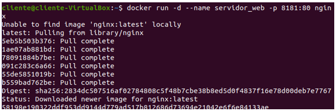
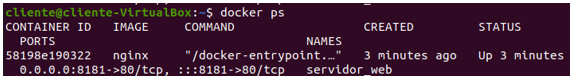
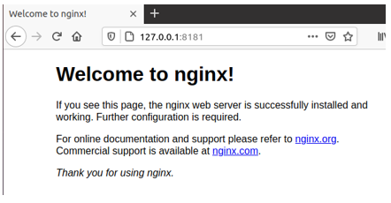
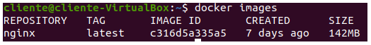
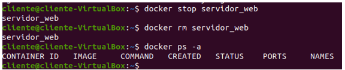

# Actividad  - Trabajar con Git

> Tarea realizada por Alejandro Cortina Santos, Rubén Gómez Regüela y Miguel Valle Miranda

[TOC]

## Ejercicio 1. Inicial 

Crear un contenedor demonio a partir de la imagen **`nginx`** , el contenedor se debe llamar `servidor_web` y se debe acceder a él utilizando el puerto 8181 del ordenador donde tengas instalado docker.

Entrega un documento con los siguientes pantallazos, y los comandos empleados para resolver cada apartado:

<div style="page-break-after: always; break-after: page;"></div>

1. Pantallazo donde se vea la creación del contenedor y podamos comprobar que el contenedor está funcionando.

   ```bash
   docker run -d --name servidor_web -p 8181:80 nginx
   ```

   

   ```bash
   docker ps
   ```

   

   <div style="page-break-after: always; break-after: page;"></div>

2. Pantallazo donde se vea el acceso al servidor web utilizando un navegador web (recuerda que tienes que acceder a la ip del ordenador donde tengas instalado docker)

   

   <div style="page-break-after: always; break-after: page;"></div>

3. Pantallazo donde se vean las imágenes que tienes en tu registro local.

   ```bash
   docker images
   ```

   

4. Pantallazo donde se vea cómo se elimina el contenedor (recuerda que antes debe estar parado el contenedor).

   

<div style="page-break-after: always; break-after: page;"></div>

## Ejercicio 2. Trabajo con imágenes

<div style="page-break-after: always; break-after: page;"></div>

## Ejercicio 3. Almacenamiento

<div style="page-break-after: always; break-after: page;"></div>

## Ejercicio 4. Redes


## Ejercicio 5. Crea una imagen con Dockerfile
